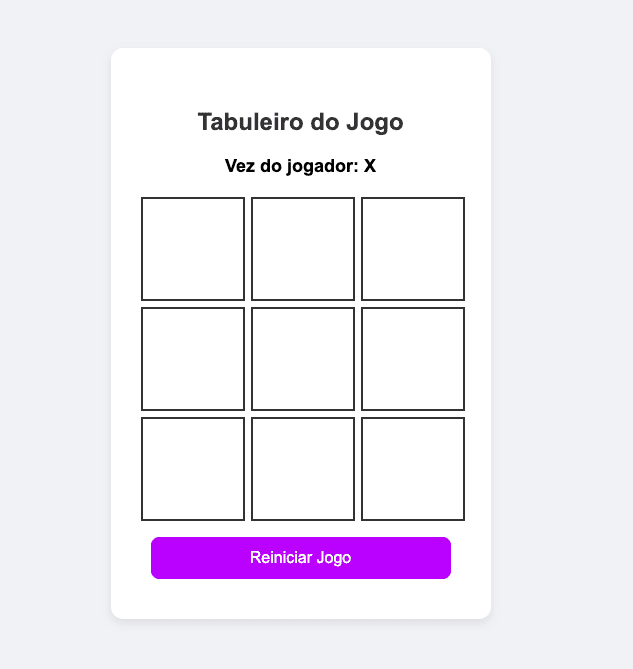

# Playgrid - Jogo da Velha

<center>



</center>

Playgrid é um jogo da velha (tic-tac-toe) desenvolvido como parte de um projeto para o **Curso de Especialização em Engenharia de Software - MBA**. É uma implementação simples e funcional do clássico jogo de tabuleiro 3x3, onde dois jogadores se alternam marcando X e O até que um deles vença ou ocorra um empate.

[](https://henriqueandrade.github.io/playgrid/)

## Tecnologias utilizadas

- HTML5
- CSS3
- JavaScript
- Jest (para testes automatizados)

## Como executar o jogo

Abra o arquivo `index.html` no seu navegador preferido para jogar.

## Como executar os testes

O projeto utiliza Jest para testes automatizados.

Instale as dependências do projeto:

```bash
# Com npm
npm install

# Ou com Yarn
yarn install
```

Para executar todos os testes:

```bash
# Com npm
npm test

# Ou com Yarn
yarn test
```
